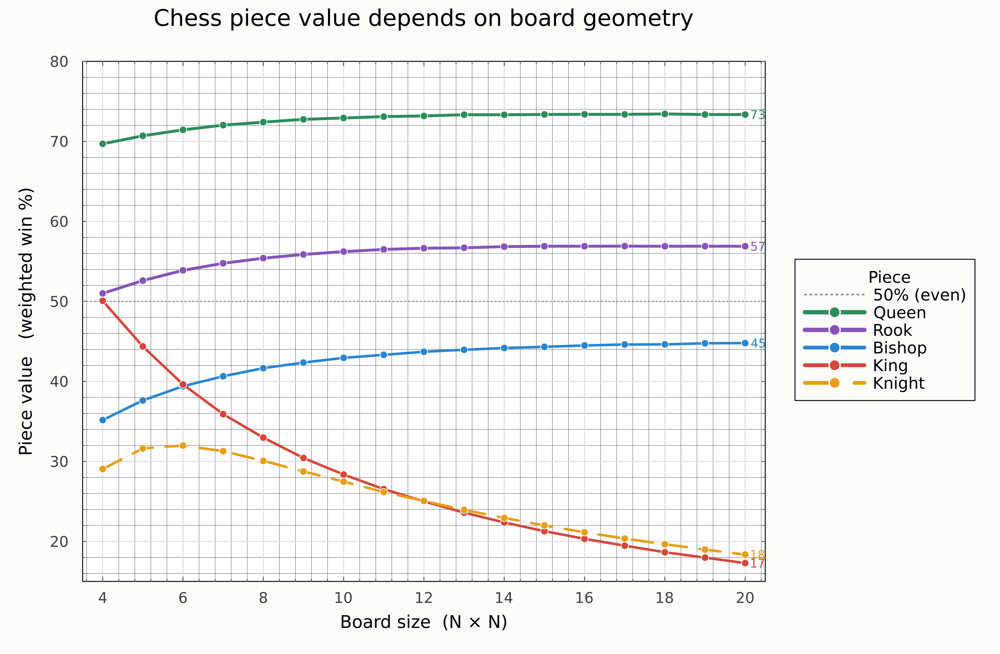

# Chess Piece Values vs. Board Size

Do the classical chess piece values (knight 3, rook 5, queen 9) hold on boards other than 8x8? This is a Monte Carlo measurement of isolated piece mobility as a function of board size.



## Model

On an empty NxN board, two pieces start on random distinct squares and alternate moves. On each turn the active piece captures the opponent if the opponent's square is among its legal moves, otherwise it moves to a uniformly random legal square. The duel ends on capture. The first player is chosen at random to avoid a first-move bias.

Running this `trials` times per pairing gives a win rate. Doing it for all 10 pairings of {King, Knight, Bishop, Rook, Queen} gives a round-robin matrix `M`, where `M[i,j]` is the win rate of piece `i` against piece `j`.

Each piece gets a scalar value: a win rate averaged over opponents, weighted by opponent strength, where opponent strength is the plain row average `w`:

```
value[i] = sum_j (M[i,j] * w[j]) / sum_j w[j]    (j != i)
```

This is one iteration of an eigenvector-style centrality. On this (transitive) data it gives the same ordering as the plain average.

The pipeline is swept over N = 4 to 30.

## Results

Two regimes:

- Sliding pieces (Queen, Rook) are board-independent. Their range scales with N, so value plateaus.
- Fixed-range pieces (King, Knight) decay with N. Their reach is constant, so they cover a vanishing fraction of a growing board. The King starts at exactly 50% on 4x4 and decreases monotonically.
- The Bishop increases then saturates.

Two crossings:

1. King and Bishop cross near N = 6.
2. King and Knight cross near N = 12 and the order then reverses: the King leads by 20+ points on 4x4 but trails the Knight by N = 30.

The Knight is non-monotonic, peaking near N = 5-6 (cramped in corners on small boards, outrun by its short jumps on large ones).

Classical values describe roughly the 8x8 regime; they are not scale-invariant.

## Termination

Each duel is a random walk of two pieces on a finite board. The capture state is reachable and the state space is finite, so the duel terminates with probability 1. Expected duel length grows like N^2, which makes large boards slow but not nonterminating. Sliding-piece duels end in a few moves; King-Knight duels on 25x25 average a few hundred.

Blocking is not modeled (pieces are not obstructed by each other), but this has no effect here: the only piece that could block the active piece is the target, and any position where the target blocks a square is a position where the target is itself capturable, ending the duel.

## Files

- `chess.jl`: move generation (multiple dispatch on piece type), duels, win matrix, value metric.
- `analysis.jl`: board-size sweep with standard deviations over repeated runs, and the plot.

## Run

```julia
] add Plots
include("analysis.jl")
```

Full 4-30 sweep at high trial counts is ~1 hour. Reduce `trials`, `R`, or `N_list` for a preview.

## Scope

Toy model: no pawns, no armies, no strategy, single value metric. It measures isolated capture ability under random play. The result is the shape of value vs N, not the specific numbers.
# chess-piece-values
